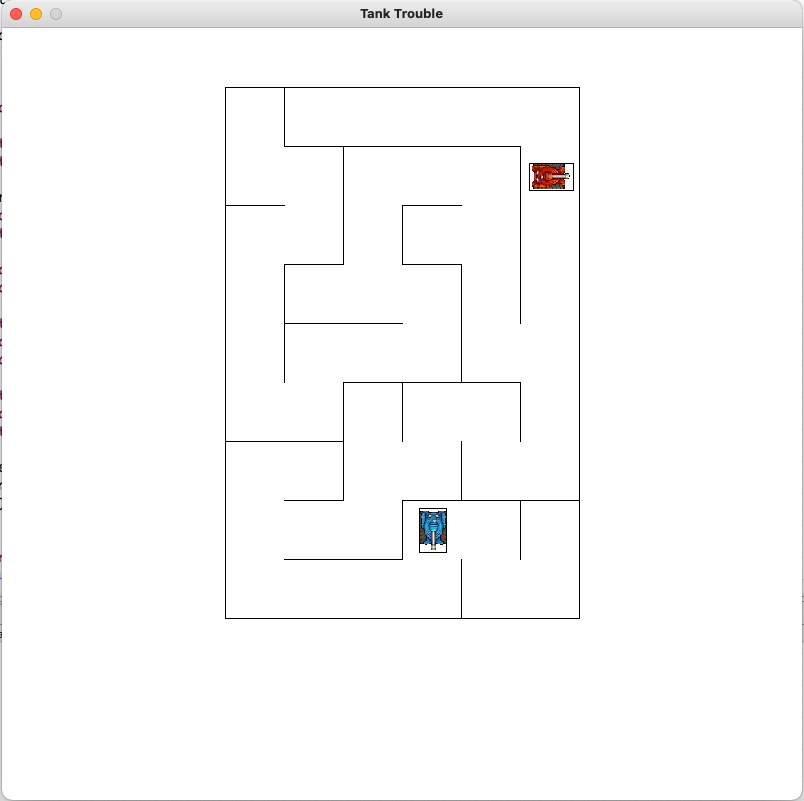

# Tank-Trouble
Java implementation of the flash game "Tank Trouble" that my friends and I really liked playing in middle school. 
The mazes and tank positions are algorithmically generated and bullets bounce off walls. Created in collaboration with computer science club. 

# Design Challenges
- Algorithmically generating unique traversable mazes
- Implementing projectile and object collision in an efficient manner
- Minimizing clipping and phasing through walls 

